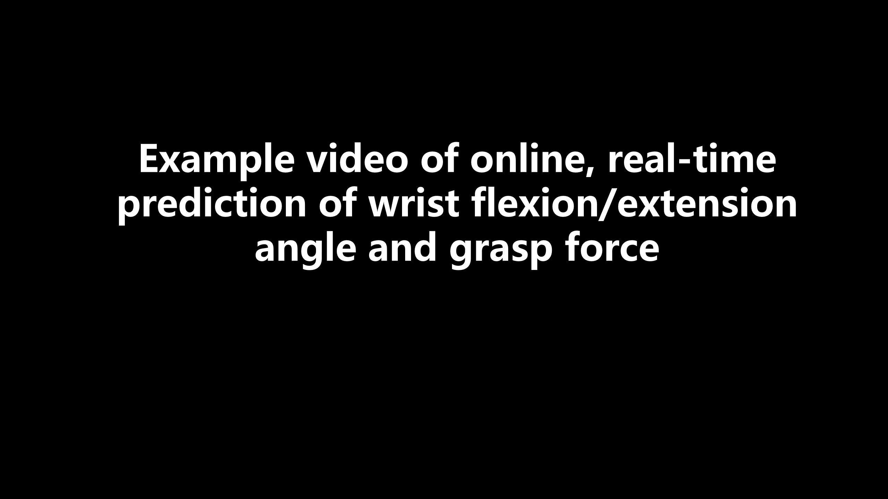

# HDEMG_ForceAngle

### Pseudo-Online Validation Script

1. This repository provides a pseudo-online validation script for evaluating real-time prediction performance.

2. Please download the sample dataset from the following link:  
   [Baidu Cloud Link](https://pan.baidu.com/s/1rJ88ViLFRw4u2fnPoXqQDg) (Access Code: `5j1k`)  
   After downloading, extract and move the data into the `offline` folder located in the main directory of the project.

3. To run the pseudo-online prediction, launch the GUI and sequentially click the **"Configure"**, **"Template"**, and **"Offline"** buttons. This will initiate real-time emulation of the prediction process based on offline data.

